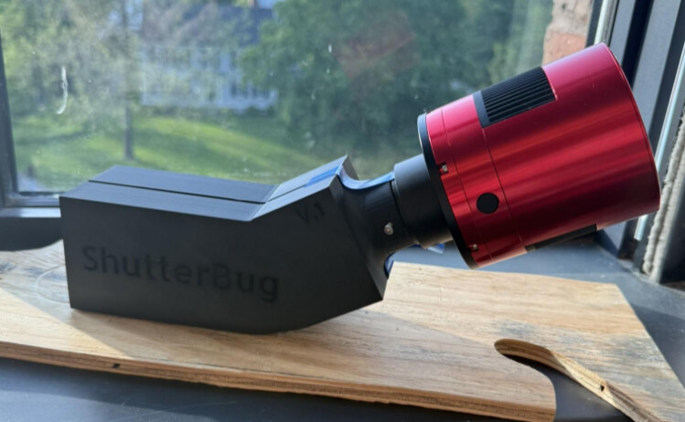
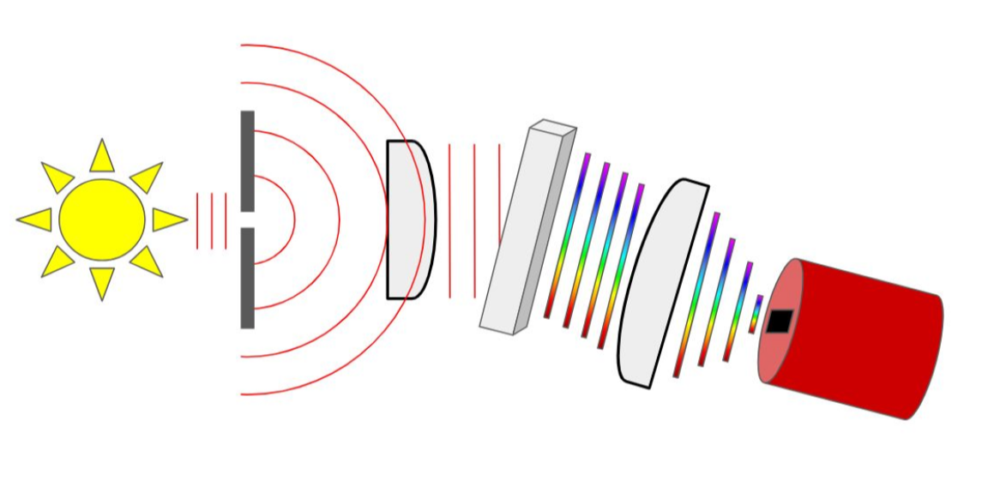
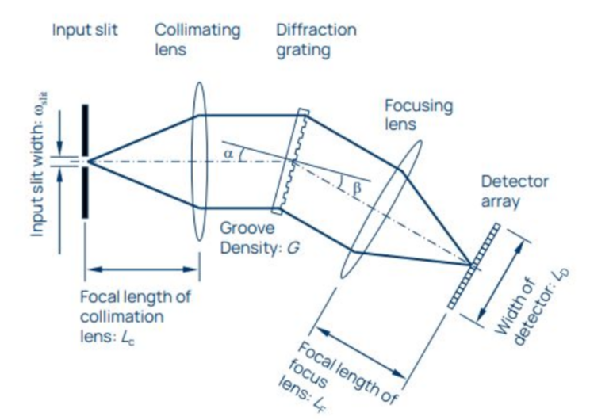
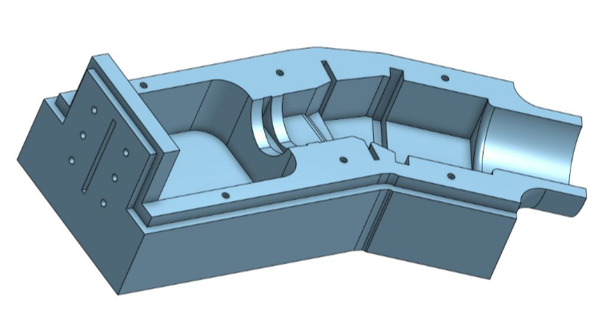
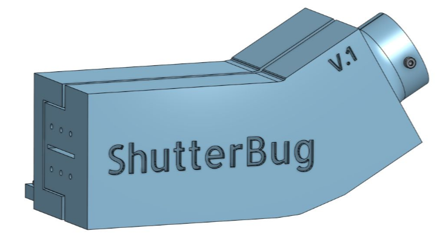
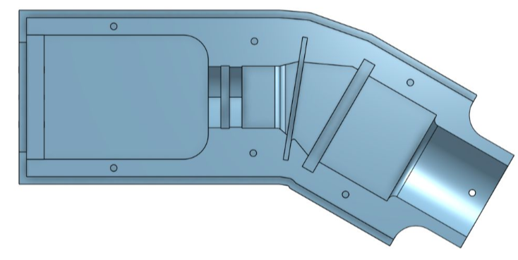
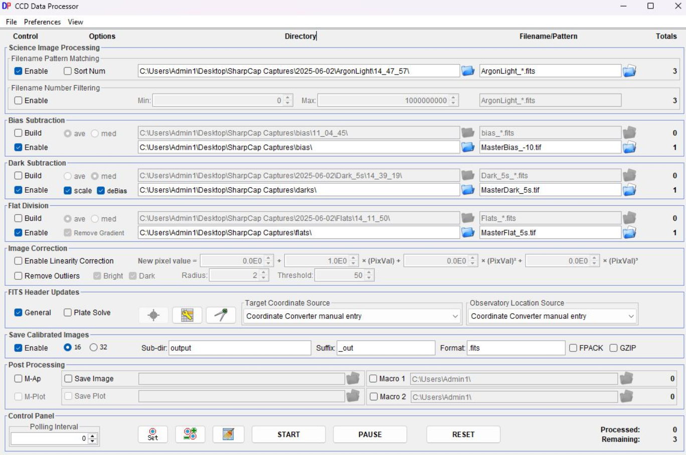
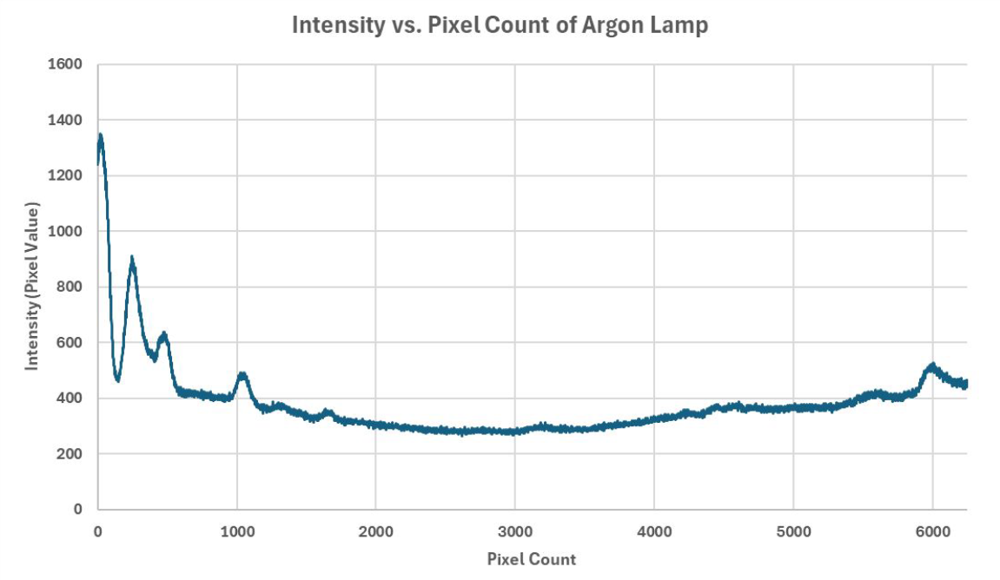
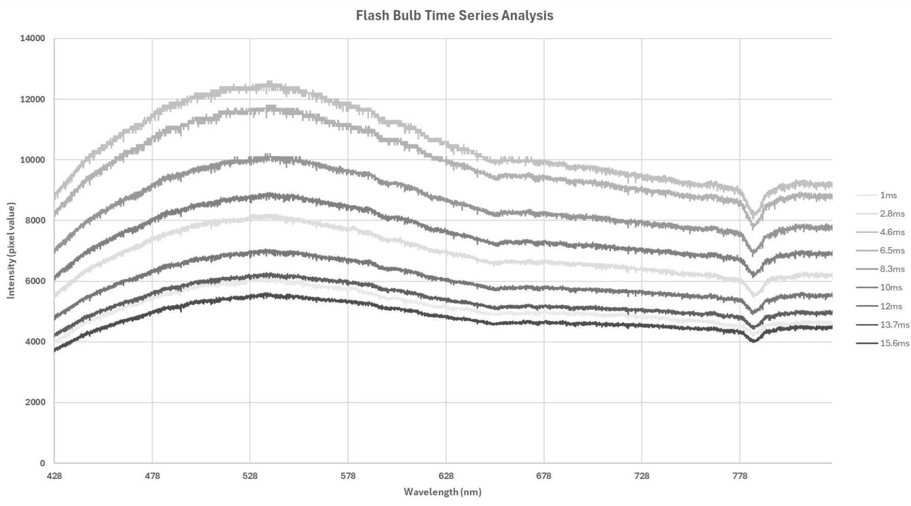

# ShutterBug

A 3D-printed transmissive grating spectrograph, built to capture time-series spectra of a vintage flash bulb.



The goals for this project were to:

- Create a working spectrograph capable of imaging the visible wavelength range.
- Capture multiple successive spectra of a vintage flash bulb.
- Calibrate and normalize the spectra to identify the bulb's temperature and any absorption lines.

This project was designed around cheap and accessible parts, at the cost of spectral resolution. See
[hardware.md](hardware.md) for the parts list and [docs/reproduce.md](docs/reproduce.md) for build and data reduction steps.

## The Spectrograph

The design began with the transmission grating layout from the Ibsen Photonics
[Spectrometer Design Guide](https://ibsen.com/wp-content/uploads/ebook/spectrometer-resources/Spectrometer-Design-Guide.pdf).
Light enters through a slit, is collimated by a lens, dispersed by the grating, and focused onto the camera sensor.

| Optical path | Design parameters (diagram: Ibsen Photonics) |
|---|---|
|  |  |

Knowing the size of the camera sensor and my ideal size for the spectrograph, I calculated the distances needed for focus:

| Parameter | Value |
|---|---|
| Groove density, G | 1000 lines/mm |
| Detector width, L_D | 33 mm |
| Angle of incidence, α | 9° |
| Diffraction angle, β | 21° |
| Focus lens focal length, L_F | 103 mm |
| Collimation lens focal length, L_C | 73 mm |
| Slit width, w_slit | 25 µm |

| CAD cutaway | Exterior | Top view |
|---|---|---|
|  |  |  |

The first print was not ideal. I used 100 mm and 71 mm plano-convex lenses (as opposed to the 103 mm and 73 mm calculated)
and two razor blades as a slit, approximating a 25–100 µm slit width to gain more light at the cost of resolution. The data
from that first build was unintelligible: dirty parts and gaps around the lens holders let light in around the edges and flood
the sensor. I was forced to reprint the CAD with a slightly changed design on a better printer.

## Obtaining Data

I took data on three sources: the flash bulb itself, a tungsten filament bulb (for flat frames), and an argon emission tube
(for wavelength calibration). SharpCap was used for capture and AstroImageJ for reduction.

The flash lasts approximately 20 ms, and I wanted ~10 individual frames of it. To get there, I imaged a 6248 x 20 pixel
region of the sensor with 1 ms exposures at about 550 FPS. That leaves hundreds of files to sift through, so a short script
kept only the frames above a minimum brightness. I settled on 9 frames of data.

Each light frame was reduced with master bias, dark, and flat frames (100 bias and 100 dark frames were averaged into their masters).



[spectral_to_csv.py](analysis/spectral_to_csv.py) then averages the central 20 rows of each image into a 1D intensity vs. pixel CSV.

## Calibrating Wavelengths

The argon lamp was dull enough that it needed 5 second exposures instead of 1 ms, so all of the calibration frames had
to be retaken at that length.



I identified 7 of the clearest peaks and matched them against Ar I and Ar II lines in the
[NIST Atomic Spectra Database](https://physics.nist.gov/PhysRefData/ASD/lines_form.html). Since the lamp runs at such a high
voltage, it's fair to assume a mixture of neutral and singly ionized argon lines. This gave a (very approximate) linear conversion:

```
wavelength (nm) = 0.06411 * (pixel) + 426.73
```

which puts the spectrograph's range across all 6248 pixels at **426.73–827.29 nm**, a large portion of the visible range.

## Results



- **Blackbody curve.** Each frame fits a smooth blackbody curve. Using Wien's law on the peak, I estimated a temperature of
  **5470 K**, very close to commonly cited flash bulb values (though sources vary).
- **Time evolution.** The flash brightens over the first few milliseconds, then lowers in intensity and
  flattens. The peak shifts slightly to the right over time, indicating a small drop in temperature over the period of the flash.
- **Absorption.** There are a few small absorption bands and one large broadband absorption region around 780 nm. Based on
  atmospheric absorption data, this matches the O₂ band (the oxygen A-band, ~760 nm), meaning the oxygen in the air between the bulb
  and the slit is absorbing that region. The offset from 760 nm is likely the calibration error described below.

## Sources of Error

- **Quantum efficiency.** I assumed the camera's sensitivity is uniform across wavelengths, when in reality it follows a curve.
  This directly affects the shape of the spectrum, and therefore the Wien's law temperature.
- **Linear calibration.** I assumed the pixel-to-wavelength conversion was linear, when it is closer to a quadratic fit. This was
  apparent in the O₂ band appearing at a longer wavelength than expected.
- **Stray light.** Room lights were on for some of the data capture. I covered any gaps in the spectrograph, but stray light could
  still affect the data.
- **Line identification.** I assumed all argon emission lines were Ar I or Ar II. Other lines in the spectrum would shift the
  conversion and could account for the discrepancy with the measured atmospheric absorption.

The original raw frames and CSVs from this run were not preserved, so the figures above are from the original analysis and the
repository includes the code and build files rather than the data.

## Repository

```
cad/        STEP and STL files for the top plate, bottom plate, and mounting bracket
analysis/   spectral_to_csv.py and requirements.txt
docs/       reproduce.md: build, calibration, and reduction steps
figures/    images used in this README
hardware.md parts list and specifications
```

## Acknowledgements

Thanks to Masaki Muneyoshi for help with the spectrum extraction script.

## Sources

- Ibsen Photonics, [Spectrometer Design Guide](https://ibsen.com/wp-content/uploads/ebook/spectrometer-resources/Spectrometer-Design-Guide.pdf)
- NIST, [Atomic Spectra Database](https://physics.nist.gov/PhysRefData/ASD/lines_form.html)
- [Wien's law](https://boyce-astro.org/wiens-law/), Boyce Research Initiatives and Education Foundation
- ZWO, [ASI2600MM Pro](https://www.zwoastro.com/product/asi2600/)
- FAU, [How the greenhouse effect works](https://www.ces.fau.edu/nasa/module-2/how-greenhouse-effect-works.php)
